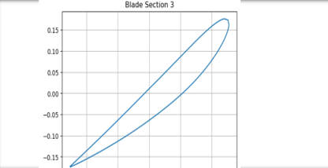
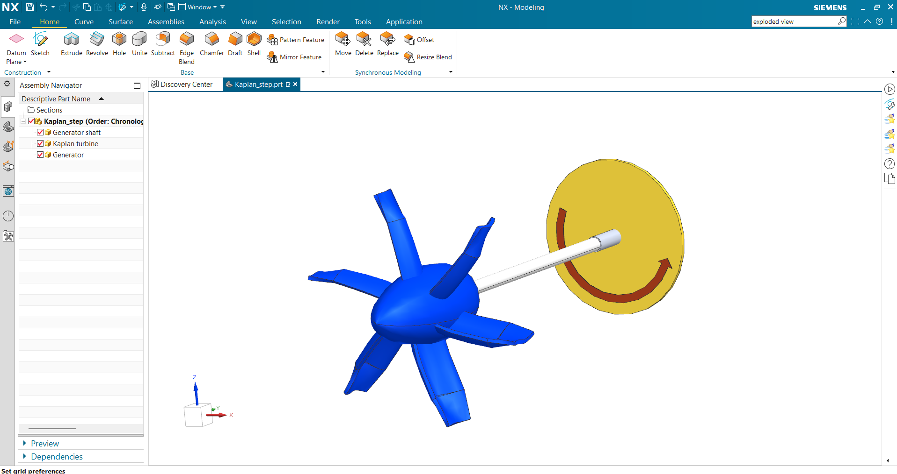
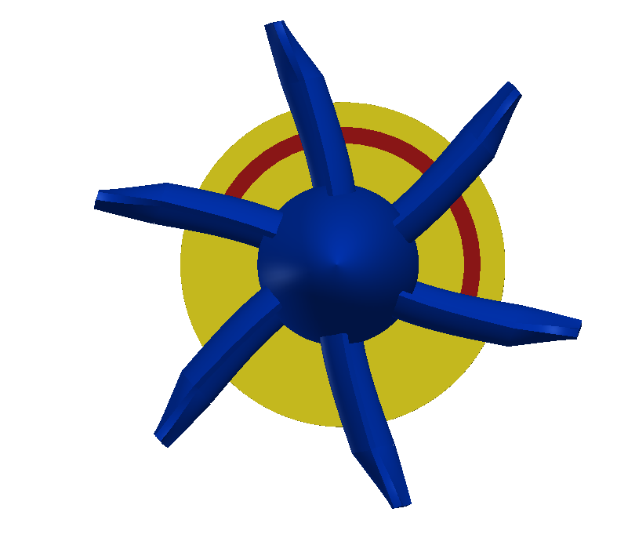
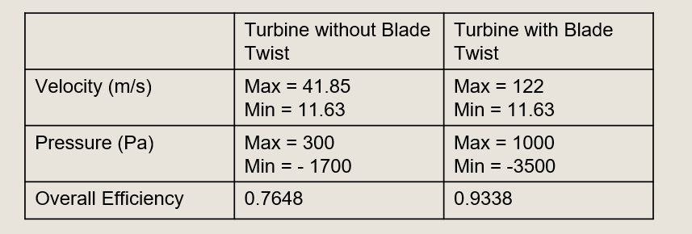

# Python-Based Kaplan Turbine Blade Design and CFD Analysis

## Overview

This project presents the design, modelling, and CFD analysis of a Kaplan turbine runner using Python-generated NACA airfoil profiles and ANSYS Fluent simulations.

The objective was to investigate the influence of blade twist on turbine performance and compare the hydraulic characteristics of twisted and untwisted Kaplan turbine runner configurations.

---

## Project Workflow

Hydraulic Design Calculations

↓

NACA 4-Digit Airfoil Generation (Python)

↓

Blade Section Generation

↓

CAD Modelling

↓

ANSYS Meshing

↓

CFD Analysis

↓

Performance Evaluation

---

# Python-Based Airfoil Generation

A custom Python workflow was developed to:

- Generate NACA 4-digit airfoil profiles
- Calculate hydraulic design parameters
- Generate blade sections along the span
- Export DXF files for CAD modelling

### Airfoil Generation Output

<p align="center">

</p>

---

# Kaplan Turbine Assembly

<p align="center">

</p>

---

# Turbine Runner Blade

<p align="center">

</p>

---

# Turbine Casing

<p align="center">

</p>

---

# Computational Mesh

<p align="center">

</p>

The CFD domain was discretized using an unstructured mesh and imported into ANSYS Fluent for flow analysis.

---

# Performance Comparison

<p align="center">

</p>

---

# Velocity Distribution Comparison

## Untwisted Blade

<p align="center">

</p>

## Twisted Blade

<p align="center">

</p>

---

# Pressure Distribution Comparison

## Untwisted Blade

<p align="center">

</p>

## Twisted Blade

<p align="center">

</p>

---

# Key Results

| Parameter | Untwisted Blade | Twisted Blade |
|------------|------------|------------|
| Maximum Velocity | 41.85 m/s | 122 m/s |
| Maximum Pressure | 300 Pa | 1000 Pa |
| Hydraulic Efficiency | 76.48% | 93.38% |
| Flow Uniformity | Moderate | High |

The twisted blade configuration demonstrated significantly higher hydraulic efficiency and improved flow characteristics compared to the untwisted blade design.

---

# Software and Tools

- Python
- NumPy
- Matplotlib
- ezdxf
- CAD Modelling
- ANSYS Fluent
- CFD Analysis

---

# Repository Structure

```text
CAD/
CFD/
Images/
Presentations/
Reports/
Python_Airfoil_Generator/
README.md
```

---

# Future Scope

- Automated blade optimization
- Parametric turbine sizing
- Multi-objective design optimization
- AI-assisted turbine blade generation

---

# Author

**Rugwed Ushir**

B.Tech Mechanical Engineering

Vishwakarma Institute of Technology, Pune