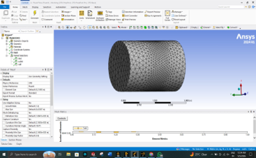

# Python-Based Kaplan Turbine Blade Design and CFD Analysis

## Overview

This project presents the design, modelling, and CFD analysis of a Kaplan turbine runner using Python-generated NACA airfoil profiles and ANSYS Fluent simulations.

The objective was to investigate the effect of blade twist on turbine performance and compare the hydraulic characteristics of twisted and untwisted runner blade configurations.

---

## Project Workflow

Hydraulic Design Calculations
→ NACA Airfoil Generation (Python)
→ Blade Section Creation
→ CAD Modelling
→ ANSYS Meshing
→ CFD Analysis
→ Performance Evaluation

---

## Airfoil Generation Using Python

A custom Python-based airfoil generator was developed to:

- Generate NACA 4-digit airfoil profiles
- Calculate blade geometry parameters
- Create blade sections along the span
- Export DXF files for CAD modelling

### Technologies Used

- Python
- NumPy
- Matplotlib
- ezdxf

---

## CAD Modelling

The generated airfoil sections were imported into CAD software to create:

- Kaplan Runner Blade
- Turbine Runner Assembly
- Turbine Casing

### Turbine Casing


---

## CFD Setup

ANSYS Fluent was used for:

- Flow analysis
- Pressure distribution study
- Velocity distribution study
- Performance comparison

### Computational Mesh



---

## Velocity Streamline Analysis

### Top View


### Side View


---

## Pressure Contour Analysis


---

## Performance Comparison

### Velocity Distribution

#### Untwisted Blade


#### Twisted Blade


### Pressure Distribution

#### Untwisted Blade


#### Twisted Blade


---

## Key Results

| Parameter | Untwisted Blade | Twisted Blade |
|------------|------------|------------|
| Maximum Velocity | 41.85 m/s | 122 m/s |
| Maximum Pressure | 300 Pa | 1000 Pa |
| Hydraulic Efficiency | 76.48% | 93.38% |
| Flow Distribution | Less Uniform | More Uniform |

The twisted blade configuration demonstrated significantly improved hydraulic performance and energy extraction compared to the untwisted blade design.

---

## Repository Structure

```text
CAD/
CFD/
Images/
Presentations/
Reports/
Python_Airfoil_Generator/
README.md
```

---

## Software Used

- Python
- NumPy
- Matplotlib
- ezdxf
- CAD Software
- ANSYS Fluent

---

## Future Work

- Automated blade optimization
- Parametric turbine design
- Multi-objective optimization
- Integration with AI-assisted design workflows

---

## Author

**Rugwed Ushir**

B.Tech Mechanical Engineering  
Vishwakarma Institute of Technology, Pune